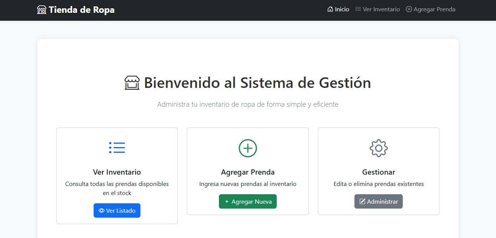
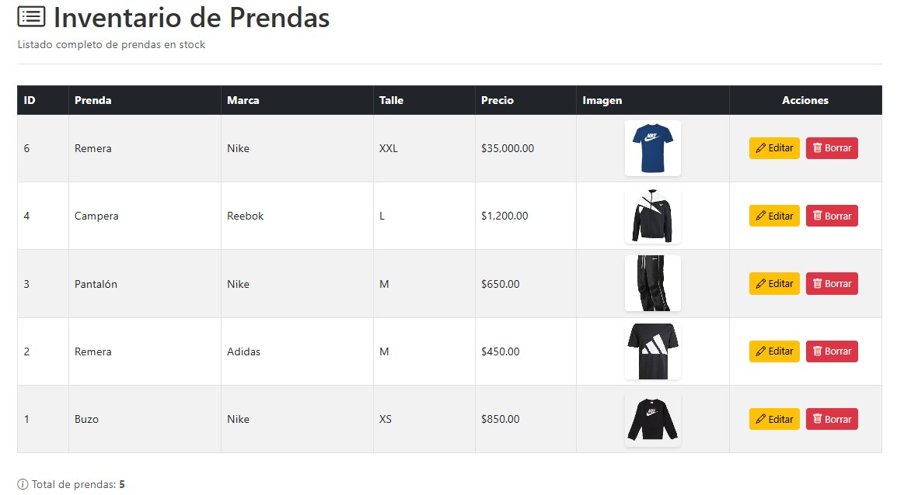
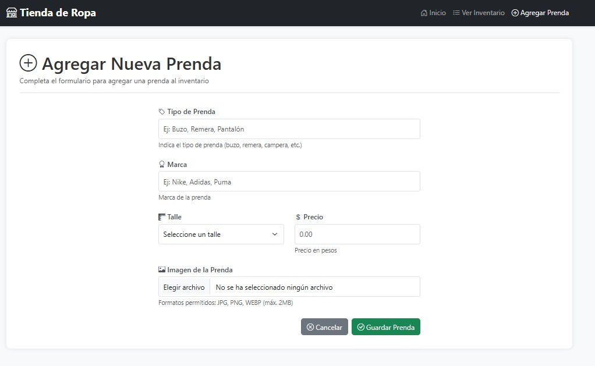
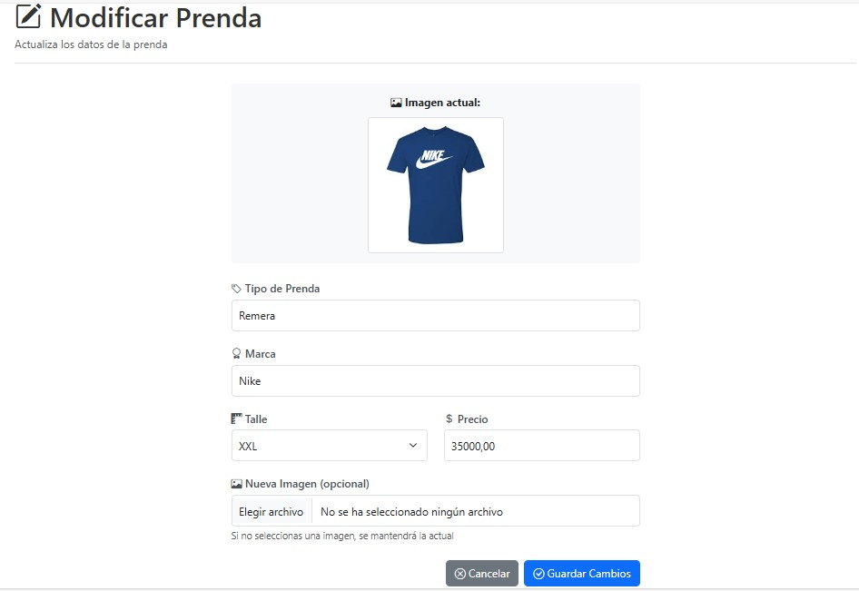

# 🛍️ Sistema de Gestión de Inventario - Tienda de Ropa

Sistema CRUD (Create, Read, Update, Delete) completo desarrollado en PHP y MySQL para la gestión de inventario de una tienda de ropa. Incluye interfaz moderna con Bootstrap 5 y manejo seguro de imágenes.


## 📋 Descripción

Proyecto desarrollado durante el curso de PHP/MySQL en el CMFP "Ricardo Rojas". Permite administrar un inventario de prendas de ropa con las siguientes funcionalidades:

- ✅ **Agregar** nuevas prendas con imágenes
- 📋 **Listar** todas las prendas del inventario
- ✏️ **Modificar** información de prendas existentes
- 🗑️ **Eliminar** prendas del sistema
- 🖼️ **Gestión de imágenes** (subida, actualización y eliminación)

## 🎯 Características Técnicas

### Seguridad Implementada
- ✅ **Prepared Statements** para prevenir SQL Injection
- ✅ **Validación de datos** en servidor
- ✅ **Sanitización de salida** con `htmlspecialchars()`
- ✅ **Validación de tipos de archivo** permitidos
- ✅ **Límite de tamaño** de imágenes (2MB)

### Mejoras sobre la Versión Original
- 🔄 Código refactorizado sin repetición
- 🔐 Seguridad mejorada con prepared statements
- 🎨 Interfaz moderna con Bootstrap 5
- 📱 Diseño responsive para móviles
- 🖼️ Preview de imágenes antes de subir
- ✨ Validaciones client-side y server-side
- 📁 Estructura organizada de archivos
- 💾 Gestión automática de archivos de imagen

## 🚀 Instalación

### Requisitos Previos
- **XAMPP** (o LAMP/WAMP/MAMP)
  - Apache 2.4+
  - PHP 7.4+ o superior
  - MySQL 5.7+ o MariaDB 10.3+
- Navegador web moderno

### Pasos de Instalación

1. **Descargar XAMPP** (si no lo tienes)
   - Descarga desde: https://www.apachefriends.org/
   - Instala y ejecuta Apache y MySQL

2. **Clonar o descargar el proyecto**
   ```bash
   cd C:\xampp\htdocs\
   git clone https://github.com/TU-USUARIO/tienda-ropa.git
   ```
   
   O descarga el ZIP y extrae en `C:\xampp\htdocs\tienda-ropa\`

3. **Crear la base de datos**
   - Abre phpMyAdmin: `http://localhost/phpmyadmin`
   - Importa el archivo `database/schema.sql`
   - (Opcional) Importa `database/sample_data.sql` para datos de ejemplo

   **O ejecuta manualmente:**
   ```sql
   CREATE DATABASE tienda;
   USE tienda;
   -- Copia y pega el contenido de schema.sql
   ```

4. **Agregar imágenes de ejemplo** (opcional)
   - Coloca imágenes en la carpeta `imagenes/`
   - Formatos: JPG, PNG, WEBP
   - Nombres sugeridos: `buzo-nike.jpg`, `remera-adidas.jpg`, etc.

5. **Acceder al sistema**
   - Abre tu navegador
   - Navega a: `http://localhost/tienda-ropa/`

¡Listo! El sistema está funcionando 🎉

## 📁 Estructura del Proyecto

```
tienda-ropa/
│
├── config/
│   └── database.php          # Configuración de conexión a BD
│
├── database/
│   ├── schema.sql             # Estructura de la base de datos
│   └── sample_data.sql        # Datos de ejemplo
│
├── imagenes/
│   ├── README.md              # Instrucciones para imágenes
│   ├── .gitkeep               # Mantiene carpeta en Git
│   └── [archivos de imagen]   # Imágenes de las prendas
│
├── css/
│   └── style.css              # Estilos personalizados
│
├── index.html                 # Página de inicio
├── listar.php                 # Listado de prendas
├── agregar.html               # Formulario agregar prenda
├── agregar.php                # Procesar nueva prenda
├── modificar.php              # Editar prenda existente
├── borrar.php                 # Eliminar prenda
├── .gitignore                 # Archivos ignorados por Git
└── README.md                  # Este archivo
```

## 💻 Uso del Sistema

### Página de Inicio
- Presenta 3 opciones principales:
  - **Ver Inventario**: Lista todas las prendas
  - **Agregar Prenda**: Formulario para nueva prenda
  - **Gestionar**: Ir a administración

### Listar Prendas
- Muestra tabla con todas las prendas
- Columnas: ID, Prenda, Marca, Talle, Precio, Imagen
- Acciones: Editar y Borrar
- Muestra imagen miniatura de cada prenda

### Agregar Prenda
- Formulario con validación
- Campos: Prenda, Marca, Talle, Precio, Imagen
- Preview de imagen antes de subir
- Validación de formato y tamaño

### Modificar Prenda
- Carga datos actuales
- Permite actualizar cualquier campo
- Mantiene imagen anterior si no se sube nueva
- Elimina imagen antigua al actualizar

### Borrar Prenda
- Confirmación antes de eliminar
- Borra registro de BD
- Elimina archivo de imagen del servidor

## 🛠️ Configuración

### Modificar Conexión a Base de Datos

Edita `config/database.php`:

```php
define('DB_HOST', '127.0.0.1');  // Host
define('DB_USER', 'root');        // Usuario
define('DB_PASS', '');            // Contraseña
define('DB_NAME', 'tienda');      // Nombre BD
```

### Cambiar Límites de Archivo

En `agregar.php` y `modificar.php`, busca:

```php
// Cambiar tamaño máximo (actualmente 2MB)
if ($_FILES['imagen']['size'] > 2 * 1024 * 1024) {
    // Modificar aquí
}
```

### Extensiones de Imagen Permitidas

En los archivos de procesamiento:

```php
$extensiones_permitidas = ['jpg', 'jpeg', 'png', 'webp'];
// Agrega o quita extensiones según necesites
```

## 🔧 Tecnologías Utilizadas

- **Backend:**
  - PHP 7.4+
  - MySQL/MariaDB
  - MySQLi (con Prepared Statements)

- **Frontend:**
  - HTML5
  - CSS3
  - Bootstrap 5.3
  - Bootstrap Icons
  - JavaScript (Vanilla)

- **Servidor:**
  - XAMPP (Apache + MySQL)

## 📚 Aprendizajes del Proyecto

Este proyecto me permitió aprender y aplicar:

- ✅ CRUD completo en PHP
- ✅ Seguridad web (SQL Injection, XSS)
- ✅ Prepared Statements en MySQLi
- ✅ Manejo de archivos en PHP
- ✅ Validación client-side y server-side
- ✅ Bootstrap para diseño responsive
- ✅ Organización de código PHP
- ✅ Gestión de errores
- ✅ Buenas prácticas de programación

## 🐛 Problemas Conocidos y Soluciones

### Error: "No se puede conectar a la base de datos"
**Solución:** Verifica que MySQL esté corriendo en XAMPP y que las credenciales en `config/database.php` sean correctas.

### Error: "Failed to open stream: Permission denied"
**Solución:** En Linux/Mac, da permisos a la carpeta imagenes:
```bash
chmod 755 imagenes/
```

### Las imágenes no se muestran
**Solución:** Verifica que la carpeta `imagenes/` existe y tiene permisos de escritura.

## 🚀 Mejoras Futuras

- [ ] Sistema de autenticación (login/logout)
- [ ] Paginación en el listado
- [ ] Búsqueda y filtros avanzados
- [ ] Categorías de productos
- [ ] Stock/cantidad de prendas
- [ ] Exportar inventario a Excel/PDF
- [ ] Panel de estadísticas
- [ ] API REST para integración
- [ ] Modo oscuro
- [ ] Multi-idioma

## 📸 Screenshots

### index


### Inventario


### Agregar


### Modificar


## 🤝 Contribuciones

Este es un proyecto educativo, pero si encuentras mejoras o bugs, siéntete libre de:
- Abrir un Issue
- Enviar un Pull Request
- Sugerir nuevas funcionalidades

## 📄 Licencia

Este proyecto fue desarrollado con fines educativos en el CMFP "Ricardo Rojas" - Morón, Buenos Aires.

---

Desarrollado por: Inti Fernandez
Curso: Programación Web - Programación Backend Developer
Programa: Potrero Digital (Fundación Compromiso)
Año: 2025

**⭐ Si este proyecto te fue útil, no olvides darle una estrella en GitHub!**
